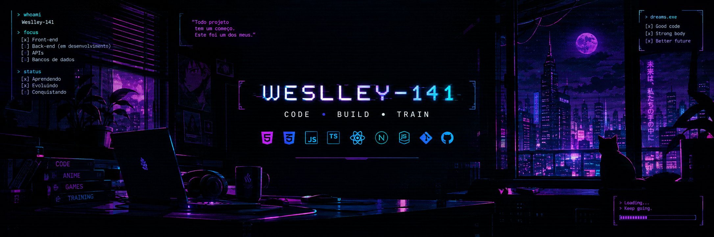

# 👋 Olá, eu sou Weslley!

### 💻 Desenvolvedor de Sistemas • 🎨 Foco em Front-end • 🏋️ Treino

 

> **Code. Learn. Build. Repeat**

## 🧑‍💻 Sobre mim

Sou **Desenvolvedor de Sistemas**, com foco em **desenvolvimento Front-end** e desenvolvimento web.

Durante minha formação, tive contato com diferentes áreas do desenvolvimento de sistemas, incluindo **Back-end, APIs e bancos de dados relacionais**. Apesar disso, foi no Front-end que encontrei minha maior afinidade e onde venho concentrando meus estudos e projetos.

Gosto de aprender **colocando a mão no código**, transformando o que estudo em projetos reais e experimentando novas ideias ao longo do caminho.

Além da programação, também gosto de **jogos, anime, tecnologia e treino** — coisas que acabam aparecendo de alguma forma nos projetos e na estética que gosto de criar.

---
## ⚡ Tecnologias

### 🎨 Front-end

### ⚙️ Back-end & Dados

### 🛠️ Ferramentas

---

## 📚 Atualmente estudando

* ⚛️ **React** — aprofundando desenvolvimento de interfaces e componentes
* 🔷 **TypeScript** — melhorando tipagem e organização dos projetos
* 🌐 **Desenvolvimento Web** — aprimorando práticas e arquitetura de aplicações
* 🟢 **Node.js** — desenvolvendo conhecimentos em Back-end e APIs
* 🧩 **Arquitetura de projetos** — buscando escrever código mais organizado e escalável

---

## 🚀 Projetos

### 🌊 Página Made in Abyss

Um dos meus primeiros projetos de desenvolvimento web, criado durante o início dos meus estudos.

Uma página estática desenvolvida com **HTML e CSS**, baseada na obra *Made in Abyss*.

> Todo projeto tem um começo. Este foi um dos meus.

---

🧩 Próximos projetos

Esta seção será atualizada conforme novos projetos forem sendo reconstruídos, desenvolvidos e publicados no GitHub.

---

---

## 🎯 Objetivos

Atualmente estou buscando evoluir cada vez mais como desenvolvedor e construir uma base sólida para minha carreira profissional, com foco principalmente em Front-end e desenvolvimento web.

Também estou em busca da minha primeira oportunidade profissional na área de desenvolvimento, onde possa aplicar meus conhecimentos, continuar aprendendo e evoluir através de projetos e experiências reais.

Quero continuar criando projetos, estudando novas tecnologias e transformando cada projeto em uma oportunidade de aprender algo novo.

---

## 🎮 Além do código

> 🎮 Games & RPGs  
> 🌌 Anime & histórias  
> 🏋️ Treino & disciplina  
> 💻 Tecnologia & curiosidade

**Sempre aprendendo. Sempre construindo.**

---

## 📫 Contato

Se quiser trocar uma ideia sobre desenvolvimento, projetos ou oportunidades:

- 💼 [LinkedIn](https://www.linkedin.com/public-profile/settings/?lipi=urn%3Ali%3Apage%3Ad_flagship3_profile_self_edit_contact_info%3BCh%2BgIOBMRlCgpOCdAybPjA%3D%3D)
- 🌐 [Portfólio](SEU_PORTFOLIO)
- 📧 [E-mail](mailto:weslleyeugenio03@gmail.com)

---

> **Code. Learn. Build. Repeat.**

